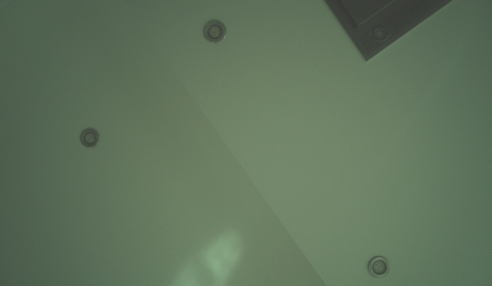

# Camera ISP: msm8974 CAMSS

Last verified against the device on 2026-09-19.

Two patches that teach mainline's `qcom/camss` driver about msm8974. The
subsystem state, the hardware map and the sensor work are in
[`../../docs/camera.md`](../../docs/camera.md); this file is about the
patches.

**They work.** On an Xperia Z2 the driver probes clean, `media-ctl` shows the
full CSIPHY → CSID → ISPIF → VFE graph, and a capture from CSID0's test
pattern generator produces correct frames. What has not been tested is a real
sensor, because no sensor driver exists yet.

| | |
|---|---|
| `0001-media-camss-add-msm8974-support.patch` | the driver: resource tables, a new SoC version, and a buffer path that works without an IOMMU |
| `0002-ARM-dts-qcom-msm8974-add-the-camss-node.patch` | the node, disabled by default; a board enables it |

## What it enumerates

    3 CSIPHY      msm_csiphy0-2
    4 CSID        msm_csid0-3
    4 ISPIF lines msm_ispif0-3
    2 VFE         msm_vfe0_rdi0-2, msm_vfe1_rdi0-2
    6 video nodes msm_vfe{0,1}_video{0,1,2}  ->  /dev/video0-5
                  plus /dev/media0 and 17 subdevs

The four ISPIF lines are worth noticing: they are the direct evidence that
msm8974 belongs with msm8996 and not msm8916 for the ISPIF, because msm8916's
code path gives two.

## Why msm8974 needs its own version enum

The obvious move is to reuse `CAMSS_8x16`: msm8974's blocks are the same
generation as msm8916's — 2-phase CSIPHY, CSID 4.1, VFE 4.1 — and that is
what z3ntu's Nexus 5 work did, binding to `qcom,msm8916-camss` outright.

It is wrong, and quietly. camss decides things by SoC version in five places,
and msm8974 does not fall on the same side at all of them:

| site | what it decides | msm8974 goes with |
|---|---|---|
| `camss.c`, allocating the ISPIF | whether there is an ISPIF at all | 8x16/8x53/8x96 |
| `camss-csiphy.c`, `base_clk_mux` | whether to map the CSIPHY clock mux register | 8x16/8x53/8x96 |
| `camss-csid.c`, `csid_src_pad_code` | 8x16 passes the sink code through, later parts remap it | **8x16** |
| `camss-vfe.c`, `vfe_src_pad_code` | which source codes a sink code can produce | **8x16** |
| `camss-ispif.c`, ×4 | ISPIF register layout, line count and interrupt handler | **8x96** |

The VFE one is a `switch` rather than a chain of `==` comparisons, so it is
easy to miss when grepping — and missing it is not silent. Its `default:` is
`WARN(1, "Unsupported HW version")`, which fires during probe with a full call
trace. That is how it was found.

## The buffer path

msm8974's camera subsystem has no IOMMU — the SoC sets neither `ARM_SMMU` nor
`QCOM_IOMMU` — which is the same constraint that puts the GPU on a VRAM
carveout. Two consequences:

- `VIDEO_QCOM_CAMSS` is excluded from the build entirely by
  `depends on (ARCH_QCOM && IOMMU_DMA)`. It does not appear in menuconfig on
  this SoC. The patch drops that dependency.
- The VFE takes one address per plane, so it cannot be handed a
  scatter-gather list. z3ntu's patch replaced scatter-gather outright, which
  would break every SoC that does have an IOMMU.

Instead the allocator is chosen from the device rather than the SoC:

    if (device_iommu_mapped(video->camss->dev))
            q->mem_ops = &vb2_dma_sg_memops;
    else
            q->mem_ops = &vb2_dma_contig_memops;

with the matching branch in `video_buf_init()`. That is a property of the
hardware, not a quirk table, and should be acceptable upstream. It is the path
the test-pattern capture below actually used.

Contiguous buffers come from CMA, and 20 MP RAW10 frames are large: the
phone's command line already carries `cma=768M` alongside `msm.vram=512m` for
the GPU. 1920x1080 works; a full-resolution queue is untested.

## Clocks, and one unreachable rate

Every clock the resource tables name is already in mainline's
`mmcc-msm8974`; none had to be added. Three things differ from msm8916:

- msm8974 has **no plain `CAMSS_AHB_CLK`**. msm8916's tables list an `"ahb"`
  clock and msm8974 has only `CAMSS_TOP_AHB_CLK` and `CAMSS_MICRO_AHB_CLK`,
  so there is no `"ahb"` entry here, and the driver does not miss it.
- Both VFEs share a single `CAMSS_VFE_GDSC`, so there is no per-VFE
  `has_pd`/`pd_name` as on msm8953; the power domain goes on the camss node,
  as on msm8916. It appears as `camss_vfe` in `pm_genpd_summary`.
- **The VFE rate list stops at 400 MHz, deliberately.** msm8974's
  `ftbl_camss_vfe_vfe0_1_clk` ends with `F(465000000, P_MMPLL3, 2, 0, 0)`, but
  `vfe0_clk_src`'s parent map is `mmcc_xo_mmpll0_mmpll1_gpll0_map`, which has
  no MMPLL3. That entry is unreachable and `clk_round_rate` returns `-ENOENT`
  for it. It matters because **with no sensor attached camss asks for the
  highest rate in the list**, so the first thing that happens on opening
  `/dev/video0` is:

      qcom-camss fda0ac00.camss: clk round rate failed: -2
      qcom-camss fda0ac00.camss: Failed to power up pipeline: -22

  and the node cannot be opened at all. Whether the real fix belongs in
  `mmcc-msm8974` — giving `vfe0_clk_src` a parent map that includes MMPLL3 —
  is worth asking upstream. Dropping the rate here is the conservative half.

## Building it

The media core has to be built first — see
[`../../docs/handover-camera.md`](../../docs/handover-camera.md), which also
covers the `Module.symvers` tooling any out-of-tree module on this phone
needs. Then:

    EXTRA_SYMVERS="$K/drivers/media/mc/Module.symvers
                   $K/drivers/media/v4l2-core/Module.symvers
                   $K/drivers/media/common/videobuf2/Module.symvers" \
      J=3 ./kbuild-mod.sh drivers/media/platform/qcom/camss \
          CONFIG_VIDEO_QCOM_CAMSS=m

Rebuilding the module needs no flash, so iterating on the driver is fast. Only
a device tree change needs one.

## Capturing from the test pattern generator

This is the check that proves the pipeline end to end without a sensor. CSID0
generates the frames, and they travel ISPIF0 → VFE0 RDI0 → `/dev/video0`.

    media-ctl -d /dev/media0 -l '"msm_csid0":1->"msm_ispif0":0[1]'
    media-ctl -d /dev/media0 -l '"msm_ispif0":1->"msm_vfe0_rdi0":0[1]'
    media-ctl -d /dev/media0 -V '"msm_csid0":0[fmt:SRGGB10_1X10/1920x1080]'
    media-ctl -d /dev/media0 -V '"msm_ispif0":0[fmt:SRGGB10_1X10/1920x1080]'
    media-ctl -d /dev/media0 -V '"msm_vfe0_rdi0":0[fmt:SRGGB10_1X10/1920x1080]'
    v4l2-ctl -d /dev/v4l-subdev3 --set-ctrl test_pattern=1
    v4l2-ctl -d /dev/video0 --set-fmt-video=width=1920,height=1080,pixelformat=pRAA
    v4l2-ctl -d /dev/video0 --stream-mmap --stream-count=10 --stream-to=/tmp/tpg.raw

`v4l-utils` is not installed by default; `apk add v4l-utils`. The subdev
numbers move between boots, so read them from `/sys/class/video4linux/*/name`
rather than assuming `v4l-subdev3` is CSID0.

Result on 2026-09-19: ten frames, 2,592,000 bytes each, which is exactly
1920 × 1080 × 10 / 8 for packed SRGGB10. The content is the generator's ramp —
row 0 begins `00 01 02 03`, row 540 begins `80 81 82 83`, all 256 byte values
present, 0.4% zeros, and successive frames identical as a static pattern
should be. No errors in dmesg.

## What is not done

- **No sensor has been attached**, because neither sensor driver exists. Every
  claim above is about the ISP, not about the cameras.
- **`vdda-supply` is missing from the node.** Sony's tree gives the CSIDs
  `pm8941_l12` at 1.8 V; without it the driver logs `supply vdda not found,
  using dummy regulator` four times at probe. Harmless for the test pattern,
  which needs no MIPI signalling, but it has to be added before a real sensor
  is wired up — and that needs another flash.
- **Only VFE0 RDI0 has been exercised.** The dual-VFE paths and the PIX
  (format-converting) lines are untouched; 8x16 ships one VFE, so two is new
  ground.
- **Only 1920x1080.** Nothing has been tried at 20 MP, where the CMA
  reservation is the thing to watch.

# Front camera sensor: Sony IMX132

`imx132.c`, and `sensor-nodes.dtsi` for the device tree half.

**It works.** The front camera captures frames on mainline Linux, and
libcamera turns them into correct colour images.

A ceiling with downlights, taken with the phone face up on a desk — through
the IMX132, CSIPHY2, CSID0, ISPIF, VFE0 and libcamera's software ISP. It is
flat and slightly green because there is no auto-exposure, no white balance
and no tuning file yet.

    cam -l
      1: 'imx132' (/base/soc/cci@fda0c000/i2c-bus@1/camera@36)

    LIBCAMERA_SOFTISP_MODE=cpu cam -c 1 --capture=3 --file=/tmp/f-#.bin
      configuring streams: (0) 1968x1144-ABGR8888/sRGB
      3 frames, 9005568 bytes each

Straight off `/dev/video0` the raw frames are 1976x1144 SBGGR10 packed, 2472
bytes per line including two bytes of stride padding, and 74% of the bytes
differ between consecutive frames — sensor noise, which is how you tell a live
camera from a test pattern.

## What it took, after the first attempt produced nothing

The first attempt ended in `VFE sof timeout` with the CSIPHY interrupt count
not moving. Three things were wrong, and only the first was obvious.

**The MIPI configuration is not where an imx219 keeps it.** This part has no
`0x0114` lane mode, no `0x0128` D-PHY control and no `0x012a` input clock
register: writes are accepted and discarded, reads come back zero. Proved by
writing `0x0340` the same way and reading the new value back, so it was those
registers and not the write path.

**The D-PHY global timing is zero at reset.** Sony keeps it at
`0x3304`-`0x330e` — TLPX, TCLK-PREPARE, TCLK-ZERO, TCLK-PRE, TCLK-POST,
TCLK-TRAIL, THS-EXIT, THS-PREPARE, THS-ZERO, THS-TRAIL — along with the lane
select at `0x3301` and about fifty analogue trim registers. Without them the
sensor accepts a streaming request and never drives the lanes. The values come
from Intel's old atomisp driver; `../../docs/prior-art.md` explains why that
source was missed for so long.

**The PLL has to match the timings.** With the vendor block in place it still
did not stream, because the driver was using the sensor's own reset PLL —
pre-divider 1, multiplier 45, a 216 MHz link — while Intel's D-PHY timings
were derived for pre-divider 2 and multiplier 80, a 192 MHz link. D-PHY
timings are only valid at the rate they were computed for. Switching the PLL
to Intel's pair produced frames on the first try.

That the same numbers give 28.4 fps at 19.2 MHz, for a table Intel named
`imx132_1080p_30fps`, is the reason to think their board fed it the same clock
this phone does.

## The GPU debayer does not work here

libcamera's software ISP defaults to an EGL debayer on the GPU, and on this
phone it fails every frame:

    ERROR Debayer debayer_egl.cpp:669 debayerGPU failed

The CPU path works. `/etc/environment.d/90-libcamera-softisp.conf` sets
`LIBCAMERA_SOFTISP_MODE=cpu` so that applications get it without having to
know. This is the same Adreno 330 that needs `/etc/sirius-renderer` set to
cairo rather than gl, so it may be the same underlying problem.

## Phosh's camera app takes a photo

Snapshot finds the camera, shows a live preview and writes a JPEG:

    ~/Pictures/Camera/Photo from 2026-09-19 15-22-05.702509.jpeg
    1920x1080, 3 components, 951 KB, complete to the EOI marker

**Two things were needed beyond the driver.** pipewire runs libcamera itself
for the camera portal, so it is pipewire's environment that has to select the
CPU debayer, not the shell's. `/etc/environment.d` does not achieve that on
its own: the user manager reads it at start, so a file written afterwards
never reaches a pipewire that is already running. The drop-in in
`../../userspace/pipewire.service.d/` is the durable answer.

The other was a trap rather than a fix. Restarting several units at once —

    systemctl --user restart pipewire pipewire-pulse wireplumber

— fails the **whole** job if any one of them does not exist, and
`pipewire-pulse` does not here. It prints `Failed to enqueue jobs` and nothing
restarts, which looks exactly like the setting not working.

## Not done

- **Colour is poor and the frame rate is low**, both with known causes.
  libcamera has no tuning file for this sensor and falls back to
  `uncalibrated.yaml`, and it has no `imx132` entry in its sensor properties
  database either, so there is no white balance and no colour matrix. The rate
  is low because the software ISP debayers 2.2 megapixels per frame on the
  CPU, the GPU path being broken here. Both are worth fixing, and the tuning
  file is worth contributing upstream.
- **No auto-exposure or white balance.** libcamera has no tuning file for this
  sensor and falls back to `uncalibrated.yaml`, and it warns that there is no
  entry for `imx132` in its sensor properties database. Both are worth
  contributing.
- libcamera also warns that a recommended V4L2 control is missing and that the
  camera location and rotation are not advertised. The location comes from a
  `location` property in the device tree; the rotation from
  `V4L2_CID_CAMERA_ORIENTATION` and `V4L2_CID_CAMERA_SENSOR_ROTATION`, which
  the driver should add.

## Things that are guesses, and how to check them

- **Analogue gain.** The reciprocal law `gain = 256 / (256 - value)` is Sony's
  usual one and the register is in the usual place, but the maximum is a
  guess. Sweep it against a fixed scene once frames arrive.
- **The clock rate**, 19.2 MHz, is settled: the board supplies it, the sensor
  was read at it, and Intel's PLL values give the frame rate their table is
  named for. Sony's own driver sets 8 MHz, which remains unexplained but is
  evidently not what this hardware needs.
- **Lane mapping** is confirmed by a working link: clock on lane 1 with data on
  0 and 2, which is what Sony's `csi-lane-mask = <0x7>` describes.
- **Bayer order.** `SBGGR10` from Sony's `subdev_code = 0x3007`. The image
  comes out with plausible colour, so it is at worst close; a wrong guess here
  shows up as swapped colours rather than as a failure.

## The image to flash

`images/boot-imx132-v1.img` — the running image plus the sensor node, the
camss `port@2` endpoint and `vdda-supply`, and nothing else.

    tail of the kernel is exactly the previous image's DTB    cmp: equal
    ramdisk, cmdline, vmlinuz after repack                    all equal
    strings -a ... | grep -c msm.vram=512m                    1
    strings -a ... | grep -c max1187x                         1
    dt-equiv.py boot-imx132-v1.img live.dtb   606 nodes, 6 differences

Every phandle in the new nodes was read back out of the built blob and checked
against its target: the supplies resolve to `l17`, `l3` and `lvs2`, the clock
to the MMCC node index 79 (`CAMSS_MCLK2_CLK`), the reset GPIO to TLMM 18, the
camss `vdda` to `l12`, and the two endpoints to each other. That check earned
its keep: the clock rate had been written `0x1249f00`, a transposition of
`0x124f800`, which would have failed the driver's frequency test at probe.

The backup taken beforehand is `images/boot-backup-before-imx132.img`; its
prefix is byte-identical to `boot-camss-v1.img`, which confirms what the phone
was running.

After flashing:

    sudo modprobe imx132
    dmesg | tail -40
    media-ctl -d /dev/media0 -p | head -30

The first question is whether probe reads the chip ID back — that exercises the
power sequence, the clock and the CCI bus together. Expect the link itself to
need work after that.

Note the master clocks are still hung off the `cci` node as well as the sensor
node. That was a workaround from before there was a sensor driver, and it
means MCLK runs whether or not the driver asks for it. It should come out once
the driver is known to manage the clock itself — `sensor-nodes.dtsi` has the
`&cci` override that removes it, and that override is deliberately **not** in
the flashed image, so this first test cannot fail for want of a clock.
